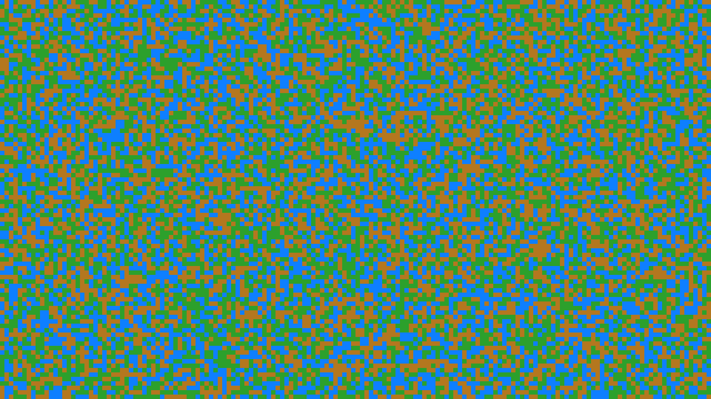

Create animations of rock-paper-scissors automata, where each cell transitions
to the next state if at least a given number of its neighbours are in that state.

Requirements are in the ``requirements.txt`` file, so ``pip install -r requirements.txt``.

Useage:

``python rps_automata.py --width <grid width> --height <grid height> --num-colours <number of states> --neighbour-threshold <neighbours needed for state transition> --seconds <number of seconds at 15 FPS>``

This will render frames in the ``frames`` directory, which can then me make into a video by
running the ``make_video.sh`` script (requires ffmpeg).

